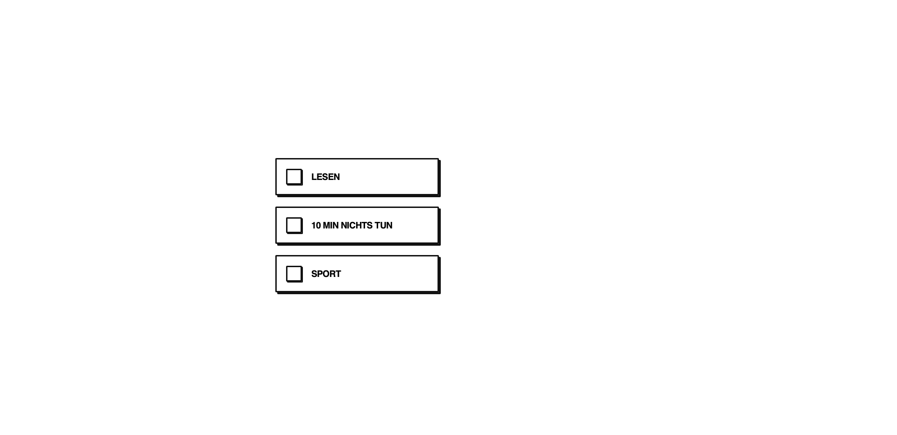

# WURZEL

> Ein minimalistischer, neo-brutalistischer Habit-Tracker gebaut mit Vue 3 (Composition API).

---

## SCREENSHOT

---

## 🛠️ Tech Stack
- **Framework:** Vue 3 (Vite)
- **Architektur:** Atomic Design (Atoms, Molecules, Organisms)
- **Styling:** CSS (Scoped, Custom Variables)

---

## 📝 DEV LOG

### [2026-06-12] - Der reaktive Durchbruch 🚀
**Heute erledigt:**
- **Atomic Design Setup:** `Checkbox.vue` (Atom), `HabitCard.vue` (Molekül) und `HabitsList.vue` (Organismus) erfolgreich voneinander isoliert und aufgebaut.
- **Datenfluss (Props & Emits):** Die Master-Liste (`habits.json`) wird via `v-for` gerendert. Klicks auf das Atom feuern Events hoch zum Organismus, wo der Zustand im Array via reaktiv umgedreht wird.
- **Styling (KI-gestützt):** Globale CSS-Variablen in der `base.css` verankert und die Scoped Styles für den harten, neo-brutalistischen Look (dicke Ränder, harte Schlagschatten, fetter Text) finalisiert. 

---