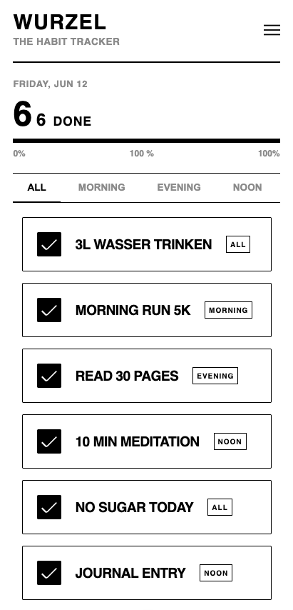

# WURZEL

> Ein minimalistischer, neo-brutalistischer Habit-Tracker gebaut mit Vue 3 (Composition API).

---

## SCREENSHOT

---

## 🛠️ Tech Stack
- **Framework:** Vue 3 (Vite)
- **Architektur:** Atomic Design (Atoms, Molecules, Organisms)
- **Styling:** CSS (Scoped, Custom Variables)

---

## 📝 DEV LOG

## 📝 DEV LOG

### [2026-06-12] - Der reaktive Durchbruch 🚀
**Heute erledigt:**
- **Brutalistisches Rebranding & Struktur:** Die App offiziell in „Wurzel – The habit tracker“ umbenannt. Die Hauptkomponente fungiert nun als übergeordnetes Template, das den Header, den Progress-Monitor und die Habit-Liste zentral steuert.
- **BEM-Naming & Clean Code:** HTML und CSS konsequent auf BEM-Struktur umgestellt (z. B. `.app-header`, `.filter-tabs__button--active`). Das Variablen-Naming im Script präzisiert (`targetHabit` statt `findHabit`).
- **Reaktiver Progress-Monitor:** - Berechnungen für den Fortschritt (`numberOfHabits`, `numberOfCheckedHabits`, `percentageOfCheckedHabits`) auf Vue `computed` Properties (mit implizitem Return) umgestellt, damit die Daten live mitleben.
  - Den Prozentwert per Dynamic Style Binding (`:style`) direkt an die CSS-Breite des inneren Balkens (`.progress-bar__fill`) gebunden.
- **Brutalistisches Tab-Design:** Die Filterleiste visuell an das Neo-Brutalismus-Design angepasst. Der aktive Zustand wird via CSS-Pseudoelement (`::after`) bündig auf die fette Trennlinie gesetzt.
- **SVG-Icon-Integration:** Das manuelle CSS-Burger-Menü durch ein natives `BurgerMenuIcon.svg` ersetzt. Die `fill`-Attribute im SVG auf `currentColor` abgeändert, um Farb-Fehler (weiß auf weiß) sauber zu beheben.
- **Atomic Design Setup:** `Checkbox.vue` (Atom), `HabitCard.vue` (Molekül) und `HabitsList.vue` (Organismus) erfolgreich voneinander isoliert und aufgebaut.
- **Datenfluss (Props & Emits):** Die Master-Liste (`habits.json`) wird via `v-for` gerendert. Klicks auf das Atom feuern Events hoch zum Organismus, wo der Zustand im Array via reaktiv umgedreht wird.
- **Styling (KI-gestützt):** Globale CSS-Variablen in der `base.css` verankert und die Scoped Styles für den harten, neo-brutalistischen Look (dicke Ränder, harte Schlagschatten, fetter Text) finalisiert. 

---