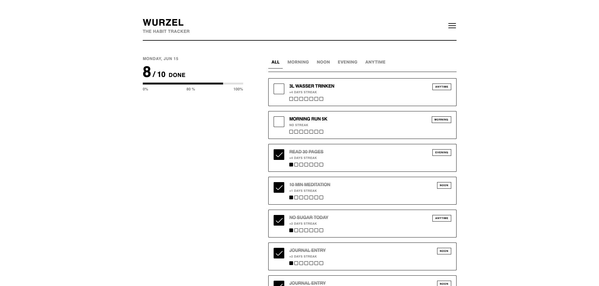

# WURZEL

> Ein minimalistischer, neo-brutalistischer Habit-Tracker gebaut mit Vue 3 (Composition API).

---

## SCREENSHOT

---

## 🛠️ Tech Stack
- **Framework:** Vue 3 (Vite)
- **Architektur:** Atomic Design (Atoms, Molecules, Organisms)
- **Styling:** CSS (Scoped, Custom Variables)

---

## 📝 DEV LOG

### [2026-06-15] - Die Usability- & Animations-Evolution ⚡
**Heute erledigt:**
- **Prop-Brücke & Reaktive Historie:** Den kritischen Daten-Bug behoben, indem das `history`-Array aus der Master-Liste (`habits.json`) via Prop (`:history`) an die `HabitCard.vue` durchgereicht wird. Das Abhaken einer Checkbox manipuliert nun reaktiv das Array, wodurch das erste Kästchen der aktuellen Woche sofort live ein- oder ausgefärbt wird.
- **Kalendarische Detektivarbeit (Computed Week):** Die Logik in `currentWeekDays` präzisiert. Über ein dynamisches JavaScript-Date-Mapping wird – ausgehend vom aktuellen Wochentag – der exakte Montag der aktuellen Woche ermittelt. Eine Schleife generiert die 7 ISO-Datums-Strings (`YYYY-MM-DD`) der laufenden Woche vollautomatisch und robust gegen Monatswechsel.
- **Lückenloser Streak-Algorithmus:** Die `streakCount`-Logik komplett repariert. Der Algorithmus prüft nun reaktiv ab heute (oder gestern, falls das Habit heute noch offen ist) lückenlos rückwärts durch das `history`-Array, bis die Kette reißt. 
- **Sticky-Layout & Desktop-Grip:** Das Dashboard-Layout für große Bildschirme optimiert. Sowohl der `progress-monitor` (links) als auch die `filter-tabs` (rechts) rasten beim Scrollen via `position: sticky` unabhängig voneinander ein.
- **Verschwindungs-Trick gegen Gucklöcher:** Das unschöne Durchblitzen der Habit-Karten beim Scrollen zwischen Header und Filter-Tabs eliminiert. Die Tabs docken jetzt visuell nahtlos mit `top: 78px` an den Header an, während der großzügige Leerraum trickreich über `padding-top` und negatives `margin-top` als massive weiße Wand simuliert wird.
- **Responsive Text-Kürzel (Lifecycle Hooks):** Ein gravierendes Platzproblem auf extrem schmalen Smartphone-Displays gelöst. Über `onMounted` und `onUnmounted` lauscht die Karte auf das `resize`-Event des Browsers. Ein reaktiver Ref (`isSmallDisplaySize`) schaltet den Text bei `< 420px` über ein Mapping-Objekt vollautomatisch auf prägnante Kurzformen (`MORN`, `NOON`, `EVE`, `ANY`) um.
- **Dopamin-Kick via Modularer Pyro-Komponente:** Ein Belohnungs-Feature für 100% erledigte Habits implementiert. Die Berechnungen wurden in die neue, isolierte Komponente `PyroCelebrate.vue` ausgelagert. Sobald die computed Property `isEverythingDone` feuert, wird ein pures, hochperformantes CSS-Feuerwerk (`@keyframes bang` & `gravity`) ohne externe Bibliotheken getriggert, das sich über einen internen `setTimeout`-Timer im `onMounted`-Hook nach exakt 3 Sekunden selbst aus dem DOM löscht.

### [2026-06-12] - Der reaktive Durchbruch 🚀
**Heute erledigt:**
- **Brutalistisches Rebranding & Struktur:** Die App offiziell in „Wurzel – The habit tracker“ umbenannt. Die Hauptkomponente fungiert nun als übergeordnetes Template, das den Header, den Progress-Monitor und die Habit-Liste zentral steuert.
- **BEM-Naming & Clean Code:** HTML und CSS konsequent auf BEM-Struktur umgestellt (z. B. `.app-header`, `.filter-tabs__button--active`). Das Variablen-Naming im Script präzisiert (`targetHabit` statt `findHabit`).
- **Reaktiver Progress-Monitor:** - Berechnungen für den Fortschritt (`numberOfHabits`, `numberOfCheckedHabits`, `percentageOfCheckedHabits`) auf Vue `computed` Properties (mit implizitem Return) umgestellt, damit die Daten live mitleben.
  - Den Prozentwert per Dynamic Style Binding (`:style`) direkt an die CSS-Breite des inneren Balkens (`.progress-bar__fill`) gebunden.
- **Brutalistisches Tab-Design:** Die Filterleiste visuell an das Neo-Brutalismus-Design angepasst. Der aktive Zustand wird via CSS-Pseudoelement (`::after`) bündig auf die fette Trennlinie gesetzt.
- **SVG-Icon-Integration:** Das manuelle CSS-Burger-Menü durch ein natives `BurgerMenuIcon.svg` ersetzt. Die `fill`-Attribute im SVG auf `currentColor` abgeändert, um Farb-Fehler (weiß auf weiß) sauber zu beheben.
- **Atomic Design Setup:** `Checkbox.vue` (Atom), `HabitCard.vue` (Molekül) und `HabitsList.vue` (Organismus) erfolgreich voneinander isoliert und aufgebaut.
- **Datenfluss (Props & Emits):** Die Master-Liste (`habits.json`) wird via `v-for` gerendert. Klicks auf das Atom feuern Events hoch zum Organismus, wo der Zustand im Array via reaktiv umgedreht wird.
- **Styling (KI-gestützt):** Globale CSS-Variablen in der `base.css` verankert und die Scoped Styles für den harten, neo-brutalistischen Look (dicke Ränder, harte Schlagschatten, fetter Text) finalisiert. 

---